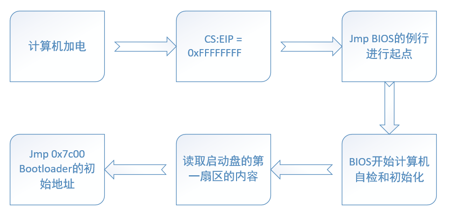
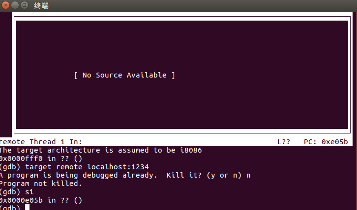
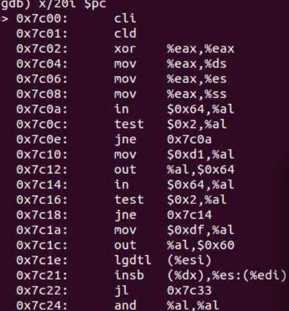
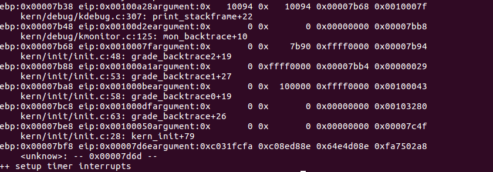
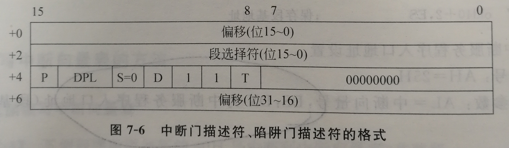
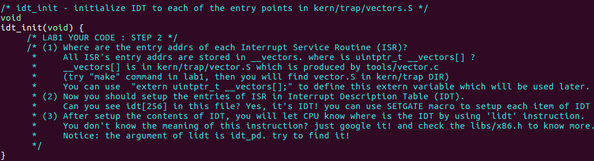
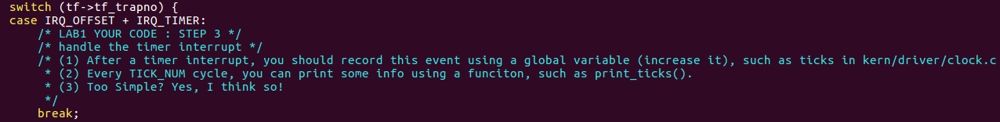

# __UCORE lab1 系统软件的启动过程__

&emsp;&emsp;`根据ucore实验报告要求，本实验报告采用markdown格式，在转化为pdf时，其中的网络链接与文本格式均相对于原文出现一定程度的改变，请查看markdown格式实验报告Github链接：`  

[Ucore 实验报告Github](https://github.com/HanlongLiao/Course/tree/master/OS/%E5%AE%9E%E9%AA%8C%E5%85%AD%20UCore)  
[查看更多OS实验报告](https://github.com/HanlongLiao/Course/tree/master/OS)


## __一、实验目的__

&emsp;&emsp;操作系统是一个软件，也需要通过某种机制加载并运行它。本实验将通过另外一个更加简单的软件-bootloader来完成这些工作。为此，需要完成一个能够切换到x86的保护模式并显示字符的bootloader，为启动操作系统ucore做准备。lab1提供了一个非常小的bootloader和ucore OS，整个bootloader执行代码小于512个字节，这样才能放到硬盘的主引导扇区中。通过分析和实现这个bootloader和ucore OS，可以了解到：

- 计算机原理
  - CPU的编址与寻址: 基于分段机制的内存管理
  - CPU的中断机制
  - 外设：串口/并口/CGA，时钟，硬盘

- Bootloader软件
  - 编译运行bootloader的过程
  - 调试bootloader的方法
  - PC启动bootloader的过程
  - ELF执行文件的格式和加载
  - 外设访问：读硬盘，在CGA上显示字符串

- ucore OS软件
  - 编译运行ucore OS的过程
  - ucore OS的启动过程
  - 调试ucore OS的方法
  - 函数调用关系：在汇编级了解函数调用栈的结构和处理过程
  - 中断管理：与软件相关的中断处理
  - 外设管理：时钟

## __二、实验内容__

&emsp;&emsp;lab1中包含一个bootloader和一个OS。这个bootloader可以切换到X86保护模式，能够读磁盘并加载ELF执行文件格式，并显示字符。而这lab1中的OS只是一个可以处理时钟中断和显示字符的幼儿园级别OS。

## __三、实验原理与步骤__

### __3.1 实验相关原理__

#### __3.1.1  BIOS启动过程__

&emsp;&emsp;计算机加电后，一般不直接执行操作系统，而是执行系统初始化软件完成基本IO初始化和引导加载功能。简单地说，系统初始化软件就是在操作系统内核运行之前运行的一段小软件。通过这段小软件，我们可以初始化硬件设备、建立系统的内存空间映射图，从而将系统的软硬件环境带到一个合适的状态，以便为最终调用操作系统内核准备好正确的环境。最终引导加载程序把操作系统内核映像加载到RAM中，并将系统控制权传递给它。

&emsp;&emsp;对于绝大多数计算机系统而言，操作系统和应用软件是存放在磁盘（硬盘/软盘）、光盘、EPROM、ROM、Flash等可在掉电后继续保存数据的存储介质上。计算机启动后，CPU一开始会到一个特定的地址开始执行指令，这个特定的地址存放了系统初始化软件，负责完成计算机基本的IO初始化，这是系统加电后运行的第一段软件代码。对于Intel 80386的体系结构而言，PC机中的系统初始化软件由BIOS \(Basic Input Output System，即基本输入/输出系统，其本质是一个固化在主板Flash/CMOS上的软件\)和位于软盘/硬盘引导扇区中的OS Boot Loader（在ucore中的bootasm.S和bootmain.c）一起组成。BIOS实际上是被固化在计算机ROM（只读存储器）芯片上的一个特殊的软件，为上层软件提供最底层的、最直接的硬件控制与支持。更形象地说，BIOS就是PC计算机硬件与上层软件程序之间的一个"桥梁"，负责访问和控制硬件。Intel的CPU具有很好的向后兼容性。在16位的8086 CPU时代，内存限制在1MB范围内，且BIOS的代码固化在EPROM中。在基于Intel的8086 CPU的PC机中的EPROM被编址在1ＭB内存地址空间的最高64KB中。PC加电后，CS寄存器初始化为0xF000，IP寄存器初始化为0xFFF0，所以CPU要执行的第一条指令的地址为CS:IP=0xF000:0XFFF0（Segment:Offset 表示）=0xFFFF0（Linear表示）。这个地址位于被固化EPROM中，指令是一个长跳转指令JMP   F000:E05B。这样就开启了BIOS的执行过程。



&emsp;&emsp;以Intel 80386为例，计算机加电后，CPU从物理地址0xFFFFFFF0（由初始化的CS：EIP确定，此时CS和IP的值分别是0xF000和0xFFF0\)）开始执行。在0xFFFFFFF0这里只是存放了一条跳转指令，通过跳转指令跳到BIOS例行程序起始点。BIOS做完计算机硬件自检和初始化后，会选择一个启动设备（例如软盘、硬盘、光盘等），并且读取该设备的第一扇区\(即主引导扇区或启动扇区\)到内存一个特定的地址0x7c00处，然后CPU控制权会转移到那个地址继续执行。至此BIOS的初始化工作做完了，进一步的工作交给了ucore的bootloader。

#### __3.1.2 bootloader启动过程__

BIOS将通过读取硬盘主引导扇区到内存，并转跳到对应内存中的位置执行bootloader。bootloader完成的工作包括：

- 切换到保护模式，启用分段机制
- 读磁盘中ELF执行文件格式的ucore操作系统到内存
- 显示字符串信息
- 把控制权交给ucore操作系统

&emsp;&emsp;对应其工作的实现文件在lab1中的boot目录下的三个文件asm.h、bootasm.S和bootmain.c。

&emsp;&emsp;在bootloader接手BIOS的工作后，当前的PC系统处于实模式（16位模式）运行状态，在这种状态下软件可访问的物理内存空间不能超过1MB，且无法发挥Intel 80386以上级别的32位CPU的4GB内存管理能力。Intel 80386只有在进入保护模式后，才能充分发挥其强大的功能，提供更好的保护机制和更大的寻址空间，否则仅仅是一个快速的8086而已。在保护模式下的分段分页机制，地址空间此处不再描述，可以参考《微机原理与接口技术》（王娟等编，清华大学出版社）第三章的内容，详细描述了在实模式与保护模式下，80386的工作方式，包括任务切换，特权级保护，地址的转换等。

&emsp;&emsp;其中有一点是需要注意的，这将在实验3有涉及。在控制寄存器的CR0中的PG标志位，决定了是否允许分页。对于逻辑地址到物理地址变化，存在两种情况：

- 启动分段机制，未启动分页机制：逻辑地址--> (分段地址转换) -->线性地址==物理地址
- 启动分段和分页机制：逻辑地址--> (分段地址转换) -->线性地址-->分页地址转换) -->物理地址

&emsp;&emsp;bootloader让CPU进入保护模式后，下一步的工作就是从硬盘上加载并运行OS。考虑到实现的简单性，bootloader的访问硬盘都是LBA模式的PIO（Program IO）方式，即所有的IO操作是通过CPU访问硬盘的IO地址寄存器完成。

&emsp;&emsp;一般主板有2个IDE通道，每个通道可以接2个IDE硬盘。访问第一个硬盘的扇区可设置IO地址寄存器0x1f0-0x1f7实现的，具体参数见下表。一般第一个IDE通道通过访问IO地址0x1f0-0x1f7来实现，第二个IDE通道通过访问0x170-0x17f实现。每个通道的主从盘的选择通过第6个IO偏移地址寄存器来设置。具体的对应关系请点击[**IO对应关系**](./picture/sectionAddr.md)

&emsp;&emsp;当前 硬盘数据是储存到硬盘扇区中，一个扇区大小为512字节。读一个扇区的流程（boot/bootmain.c中的readsect函数实现）大致如下：

1. 等待磁盘准备好
2. 发出读取扇区的命令
3. 等待磁盘准备好
4. 把磁盘扇区数据读到指定内存

ELF(Executable and linking format)文件格式是Linux系统下的一种常用目标文件(object file)格式，有三种主要类型:

- 用于执行的可执行文件(executable file)，用于提供程序的进程映像，加载的内存执行。 这也是本实验的OS文件类型。
- 用于连接的可重定位文件(relocatable file)，可与其它目标文件一起创建可执行文件和共享目标文件。
- 共享目标文件(shared object file),连接器可将它与其它可重定位文件和共享目标文件连接成其它的目标文件，动态连接器又可将它与可执行文件和其它共享目标文件结合起来创建一个进程映像。

&emsp;&emsp;可执行文件的 ELF header在文件开始处描述了整个文件的组织，在ucore的实验代码中包含在elf.h中，关于ELF的更多信息，点击[**ELF说明**](./picture/ELF.md)

#### __3.1.3 操作系统启动过程__

&emsp;&emsp;当bootloader通过读取硬盘扇区把ucore在系统加载到内存后，就转跳到ucore操作系统在内存中的入口位置（kern/init.c中的kern_init函数的起始地址），这样ucore就接管了整个控制权。实验1的ucore完成的功能有：

- 初始化终端；
- 显示字符串；
- 显示堆栈中的多层函数调用关系；
- 切换到保护模式，启用分段机制；
- 初始化中断控制器，设置中断描述符表，初始化时钟中断，使能整个系统的中断机制；
- 执行while（1）死循环。

在练习5中需要涉及到堆栈的相应内容：
序执行到一个函数的实际指令前，已经有以下数据顺序入栈：参数、返回地址、ebp寄存器。由此得到类似如下的栈结构（参数入栈顺序跟调用方式有关，这里以C语言默认的CDECL为例）：

```
+|栈底方向	     | 高位地址
 |...		    |
 |...		    |
 |参数3		    |
 |参数2		    |
 |参数1		    |
 |返回地址		 |
 |上一层[ebp]| <-------- [ebp]
 |局部变量		|  低位地址
```
&emsp;&emsp;关于中断与异常的相关内容，可以参考《微机原理与接口技术》（王娟等编，清华大学出版社）第七章，说明地较为详细。在80386中，标志寄存器中的D9位IF是中断允许标志。当IF = 1 时，允许CPU接收外部中断请求，此时是"开中断"状态；当IF位 = 0时，则屏蔽外部中断请求，此时为"关中断"。关于本实验中关于中断的描述，请点击[**中断与异常**](./picture/interrupter.md)

### __3.2 实验内容与步骤__

#### __3.2.1 练习1__

>_理解通过make生成执行文件的过程。（要求在报告中写出对下述问题的回答)_
>_列出本实验各练习中对应的OS原理的知识点，并说明本实验中的实现部分如何对应和体现了原理中的基本概念和关键知识点。_
_在此练习中，大家需要通过静态分析代码来了解:_  
_1. 操作系统镜像文件ucore.img是如何一步一步生成的？(需要比较详细地解释Makefile中每一条相关命令和命令参数的含义，以及说明命令导致的结果)_  
_2. 一个被系统认为是符合规范的硬盘主引导扇区的特征是什么?_

&emsp;&emsp;练习1,需要理解ucore.img是如何一步一步生成的，则就要阅读makefile文件，工程的makefile文件非常复杂，需要读懂非常困难,需要非常熟悉makefile语法。我在网上看到了一篇博客写得非常详细的：[**ucore实验lab1练习1**](https://www.shiyanlou.com/courses/reports/1054572)  
在根目录打开makefile文件中，首先能够找到生成ucore.img的部分

这一部分的内容大概是：

1. 首先创建块文件，使用的方法是dd命令，首先创建一块[512*10000]的文件；从设备文件/dev/zero进行拷贝；默认的一块block为512Bytes；
2. 这个镜像文件中将[引导扇区]的文件内容拷贝到第一块block中，正好是512个字节；
3. 然后将内核文件从镜像文件的第二块区域开始进行拷贝，所以需要使用seek来跳过第一块block；

```makefile
# create ucore.img
UCOREIMG	:= $(call totarget,ucore.img)

$(UCOREIMG): $(kernel) $(bootblock)
	$(V)dd if=/dev/zero of=$@ count=10000
	$(V)dd if=$(bootblock) of=$@ conv=notrunc
	$(V)dd if=$(kernel) of=$@ seek=1 conv=notrunc
```
&emsp;&emsp;可以发现在上述最为主要的信息是 $(UCOREIMG): $(kernel) $(bootblock)，说明ccore.img依赖kernel 和 bootblock。
三行的生成代码分别代表三个地方的代码拷贝到相应的UCOREIMG中来
接下来接着看bootblock和kernel分别是如何生成的，同样看makefile文件中相应的描述：
```makefile
bootfiles = $(call listf_cc,boot)
$(foreach f,$(bootfiles),$(call cc_compile,$(f),$(CC),$(CFLAGS) -Os -nostdinc))
bootblock = $(call totarget,bootblock)

$(bootblock): $(call toobj,$(bootfiles)) | $(call totarget,sign)
	@echo + ld $@
	$(V)$(LD) $(LDFLAGS) -N -e start -Ttext 0x7C00 $^ -o $(call toobj,bootblock)
	@$(OBJDUMP) -S $(call objfile,bootblock) > $(call asmfile,bootblock)
	@$(OBJDUMP) -t $(call objfile,bootblock) | $(SED) '1,/SYMBOL TABLE/d; s/ .* / /; /^$$/d' > $(call symfile,bootblock)
	@$(OBJCOPY) -S -O binary $(call objfile,bootblock) $(call outfile,bootblock)
	@$(call totarget,sign) $(call outfile,bootblock) $(bootblock)
```
&emsp;&emsp;从地三行开始是bootfiles的主要生成部分，bootblock的依赖文件主要这里分成了两个，两个之一都可以满足条件：
- 前一个的作用是调用了toobj函数，实现了在.o文件前加obj 前缀的功能
- 而第二个是在依赖文件sign前加bin。所以此处还应该涉及到另一个bootblock的依赖文件sign

在sign.c中有如下代码：
```c
    char buf[512];
    memset(buf, 0, sizeof(buf));
    FILE *ifp = fopen(argv[1], "rb");
    int size = fread(buf, 1, st.st_size, ifp);
    if (size != st.st_size) {
        fprintf(stderr, "read '%s' error, size is %d.\n", argv[1], size);
        return -1;
    }
    fclose(ifp);
    buf[510] = 0x55;
    buf[511] = 0xAA;
```
&emsp;&emsp;由以上代码可知，主引导扇区的大小是512字节，并且第511个字节是0x55,第511个字节是0xAA

#### __3.2.2 练习2__

>_为了熟悉使用qemu和gdb进行的调试工作，我们进行如下的小练习：_
>
>_1. 从CPU加电后执行的第一条指令开始，单步跟踪BIOS的执行。_  
_2. 在初始化位置0x7c00设置实地址断点,测试断点正常。_  
_3. 从0x7c00开始跟踪代码运行,将单步跟踪反汇编得到的代码与bootasm.S和 bootblock.asm进行比较。_  
_4. 自己找一个bootloader或内核中的代码位置，设置断点并进行测试。_

&emsp;&emsp;在lab1文件夹中直接输入make debug，则可以开启qemu的状态

&emsp;&emsp;由于在degub文件中已经定义了target remote localhost:1234,则此处可以直接使用make debug指令来进行调试　　
在输入了make degub之后，可以进行输入si进行单步调试  
效果如下：  
  
按照要求在0x7c00位置设置断点，并且查看当前的20行代码　　
  
将结果与bootasm.S和bootblock.asm中的相应代码进行比较  
```asm
seta20.1:
    inb $0x64, %al                                  # Wait for not busy(8042 input buffer empty).
    testb $0x2, %al
    jnz seta20.1

    movb $0xd1, %al                                 # 0xd1 -> port 0x64
    outb %al, $0x64                                 # 0xd1 means: write data to 8042's P2 port

seta20.2:
    inb $0x64, %al                                  # Wait for not busy(8042 input buffer empty).
    testb $0x2, %al
    jnz seta20.2

    movb $0xdf, %al                                 # 0xdf -> port 0x60
    outb %al, $0x60                                 # 0xdf = 11011111, means set P2's A20 bit(the 1 bit) to 1

```
可以发现，设置的断点的位置和汇编代码中保持一致。


#### __3.2.3 练习3__

>_BIOS将通过读取硬盘主引导扇区到内存，并转跳到对应内存中的位置执行bootloader。请分析bootloader是如何完成从实模式进入保护模式的。_

&emsp;&emsp;由于intel芯片的向下兼容的原因，UCORE构造出了A20 gate，通过它来控制是否进行“ *回绕* ”，当使用了80386这个cpu时，无论是实模式还是保护模式，我们都需要将A20使能，保证其可以正常使用从而不产生回绕；所以bootloader进行的过程主要有以下几个主要的过程：
* 使能A20;
* 初始化全局描述符表，保证可以确定出数据/代码等相关数据的位置；
* 使能[保护模式]；
* 最后将ucore的代码，数据等加载到内存中；

&emsp;&emsp;这是一个大致的过程，实际上根据bootasm.S的描述（描述中是汇编代码，很难看懂），有很多的细节需要理解；

接下来分析bootloader 进入保护模式的过程。

从 %cs=0 $pc=0x7c00，进入后

首先清理环境：包括将flag置0和将段寄存器置0
```s
	.code16
	    cli
	    cld
	    xorw %ax, %ax
	    movw %ax, %ds
	    movw %ax, %es
	    movw %ax, %ss
```

&emsp;&emsp;开启A20：通过将键盘控制器上的A20线置于高电位，全部32条地址线可用，
可以访问4G的内存空间。
```s
	seta20.1:               # 等待8042键盘控制器不忙
	    inb $0x64, %al      # 
	    testb $0x2, %al     #
	    jnz seta20.1        #
	
	    movb $0xd1, %al     # 发送写8042输出端口的指令
	    outb %al, $0x64     #
	
	seta20.1:               # 等待8042键盘控制器不忙
	    inb $0x64, %al      # 
	    testb $0x2, %al     #
	    jnz seta20.1        #
	
	    movb $0xdf, %al     # 打开A20
	    outb %al, $0x60     # 
```

&emsp;&emsp;初始化GDT表：一个简单的GDT表和其描述符已经静态储存在引导区中，载入即可，GDT(global description table)，即将全局描述符表加载到内存中，点击查看更多[**GDTR**](https://en.wikibooks.org/wiki/X86_Assembly/Global_Descriptor_Table)的信息
```s
	    lgdt gdtdesc
```
&emsp;&emsp;还需要说明的是：关于GDTR的作用，GDTR中不仅保存了GDT的地址，还保存了GDT的长度，我们从代码中都可以看出：
```asm
gdtdesc:
.word 0x17                                      # sizeof(gdt) - 1
.long gdt                                       # address gdt
```
&emsp;&emsp;进入保护模式：通过将cr0寄存器PE位置1便开启了保护模式
```s
	    movl %cr0, %eax
	    orl $CR0_PE_ON, %eax
	    movl %eax, %cr0
```

&emsp;通过长跳转更新cs的基地址
```s
	 ljmp $PROT_MODE_CSEG, $protcseg
	.code32
	protcseg:
```

&emsp;设置段寄存器，并建立堆栈
```s
	    movw $PROT_MODE_DSEG, %ax
	    movw %ax, %ds
	    movw %ax, %es
	    movw %ax, %fs
	    movw %ax, %gs
	    movw %ax, %ss
	    movl $0x0, %ebp
	    movl $start, %esp
```
转到保护模式完成，进入boot主方法
```s
	    call bootmain
```
### __练习4__

>_通过阅读bootmain.c，了解bootloader如何加载ELF文件。通过分析源代码和通过qemu来运行并调试bootloader&OS，_
>
>_bootloader如何读取硬盘扇区的？_
_bootloader是如何加载ELF格式的OS？_
_分析bootloader加载ELF格式的OS的过程。_

&emsp;&emsp;首先看readsect函数，
`readsect`从设备的第secno扇区读取数据到dst位置
```c
	static void
	readsect(void *dst, uint32_t secno) {
	    waitdisk();
	
	    outb(0x1F2, 1);                         // 设置读取扇区的数目为1
	    outb(0x1F3, secno & 0xFF);
	    outb(0x1F4, (secno >> 8) & 0xFF);
	    outb(0x1F5, (secno >> 16) & 0xFF);
	    outb(0x1F6, ((secno >> 24) & 0xF) | 0xE0);
	        // 上面四条指令联合制定了扇区号
	        // 在这4个字节线联合构成的32位参数中
	        //   29-31位强制设为1
	        //   28位(=0)表示访问"Disk 0"
	        //   0-27位是28位的偏移量
	    outb(0x1F7, 0x20);                      // 0x20命令，读取扇区
	
	    waitdisk();

	    insl(0x1F0, dst, SECTSIZE / 4);         // 读取到dst位置，
	                                            // 幻数4因为这里以DW为单位
	}
```
&emsp;&emsp;关于四条指令中的第一个参数有如下的解释：  
  
readseg简单包装了readsect，可以从设备读取任意长度的内容。

```c
	static void
	readseg(uintptr_t va, uint32_t count, uint32_t offset) {
	    uintptr_t end_va = va + count;
	
	    va -= offset % SECTSIZE;
	
	    uint32_t secno = (offset / SECTSIZE) + 1; 
	    // 加1因为0扇区被引导占用
	    // ELF文件从1扇区开始
	
	    for (; va < end_va; va += SECTSIZE, secno ++) {
	        readsect((void *)va, secno);
	    }
	}
```
&emsp;&emsp;

在bootmain函数中
```c
	void
	bootmain(void) {
	    // 首先读取ELF的头部
	    readseg((uintptr_t)ELFHDR, SECTSIZE * 8, 0);
	
	    // 通过储存在头部的幻数判断是否是合法的ELF文件
	    if (ELFHDR->e_magic != ELF_MAGIC) {
	        goto bad;
	    }
	
	    struct proghdr *ph, *eph;
	
	    // ELF头部有描述ELF文件应加载到内存什么位置的描述表，
	    // 先将描述表的头地址存在ph
	    ph = (struct proghdr *)((uintptr_t)ELFHDR + ELFHDR->e_phoff);
	    eph = ph + ELFHDR->e_phnum;
	
	    // 按照描述表将ELF文件中数据载入内存
	    for (; ph < eph; ph ++) {
	        readseg(ph->p_va & 0xFFFFFF, ph->p_memsz, ph->p_offset);
	    }
	    // ELF文件0x1000位置后面的0xd1ec比特被载入内存0x00100000
	    // ELF文件0xf000位置后面的0x1d20比特被载入内存0x0010e000

	    // 根据ELF头部储存的入口信息，找到内核的入口
	    ((void (*)(void))(ELFHDR->e_entry & 0xFFFFFF))();
	
	bad:
	    outw(0x8A00, 0x8A00);
	    outw(0x8A00, 0x8E00);
	    while (1);
	}
```
&emsp;&emsp;由readseg函数读取硬盘扇区,读取完磁盘之后，开始加载ELF格式的文件。先判断是不是ELF，然后定义ph为** ELF 段表首地址，eph 为 **ELF 段表末地址,将ELF头部的描述表读取出来将之存入，依次将ELF文件写入内存，最后根据描述表的信息找到入口运行。如果失败将陷入循环。

&emsp;&emsp;链接视图通过Section Header Table描述，执行视图通过Program Header Table描述。Section Header Table描述了所有Section的信息，包括所在的文件偏移和大小等；Program Header Table描述了所有Segment的信息，即Text Segment, Data Segment和BSS Segment，每个Segment中包含了一个或多个Section。
&emsp;&emsp;对于加载可执行文件，只需关注执行视图，即解析ELF文件，遍历Program Header Table中的每一项，把每个Program Header描述的Segment加载到对应的虚拟地址即可，然后从ELF header中取出Entry的地址，跳转过去就开始执行了。对于ELF格式的内核文件来说，这个工作就需要由Bootloader完成。


完成了练习4之后，整个kernel的加载并将控制权转移的过程结束。

### 练习5 ：实现函数调用堆栈跟踪函数


_我们需要在lab1中完成kdebug.c中函数print_stackframe的实现，可以通过函数print_stackframe来跟踪函数调用堆栈中记录的返回地址。在如果能够正确实现此函数，可在lab1中执行 “make qemu”后，在qemu模拟器中得到类似如下：_

	……
	ebp:0x00007b28 eip:0x00100992 args:0x00010094 0x00010094 0x00007b58 0x00100096
	    kern/debug/kdebug.c:305: print_stackframe+22
	ebp:0x00007b38 eip:0x00100c79 args:0x00000000 0x00000000 0x00000000 0x00007ba8
	    kern/debug/kmonitor.c:125: mon_backtrace+10
	ebp:0x00007b58 eip:0x00100096 args:0x00000000 0x00007b80 0xffff0000 0x00007b84
	    kern/init/init.c:48: grade_backtrace2+33
	ebp:0x00007b78 eip:0x001000bf args:0x00000000 0xffff0000 0x00007ba4 0x00000029
	    kern/init/init.c:53: grade_backtrace1+38
	ebp:0x00007b98 eip:0x001000dd args:0x00000000 0x00100000 0xffff0000 0x0000001d
	    kern/init/init.c:58: grade_backtrace0+23
	ebp:0x00007bb8 eip:0x00100102 args:0x0010353c 0x00103520 0x00001308 0x00000000
	    kern/init/init.c:63: grade_backtrace+34
	ebp:0x00007be8 eip:0x00100059 args:0x00000000 0x00000000 0x00000000 0x00007c53
	    kern/init/init.c:28: kern_init+88
	ebp:0x00007bf8 eip:0x00007d73 args:0xc031fcfa 0xc08ed88e 0x64e4d08e 0xfa7502a8
	<unknow>: -- 0x00007d72 –
	……

实验指导书中提示看课本，课本中关于堆栈的表述如下：  
  
课本的解释如下：  
&emsp;&emsp;这两条汇编指令的含义是：首先将ebp 寄存器入栈，然后将栈顶指针 esp 赋值给 ebp。movl %esp %ebp这条指令表面上看是用esp覆盖 ebp原来的值，其实不然。因为给 ebp赋值之前，原ebp 值已经被压栈（位于栈顶），而新的ebp又恰恰指向栈顶。此时ebp寄存器就已经处于一个非常重要的地位，该寄存器中存储着栈中的一个地址（原 ebp入栈后的栈顶），从该地址为基准，向上（栈底方向）能获取返回地址、参数值，向下（栈顶方向）能获取函数局部变量值，而该地址处又存储着上一层函数调用时的ebp值。  
&emsp;&emsp;一般而言，ss:[ebp+4]处为返回地址（即调用时的 eip），ss:[ebp+8]处为第一个参数值（最后一个入栈的参数值，此处假设其占用4字节内存），ss:[ebp-4]处为第一个局部变量，ss:[ebp]处为上一层ebp值。由于ebp中的地址处总是“上一层函数调用时的ebp值”，而在每一层函数调用中，都能通过当时的ebp值“向上（栈底方向）”能获取返回地址、参数值，“向下（栈顶方向）”能获取函数局部变量值。如此形成递归，直至到达栈底。这就是函数调用栈。

根据这个说明，我们需要在注释部分填入的信息如下：  
```cpp
uint32_t ebp = read_ebp();
uint32_t eip = read_eip();

int i = 0;
for(i = 0; i < STACKFRAME_DEPTH && ebp != 0; i++){
    cprintf("ebp:0x%08x eip:0x%08x", ebp, eip);
    uint32_t *argu = (uint32_t *)ebp + 2;
    cprintf("argument:0x%8x 0x%8x 0x%08x 0x%08x", argu[0], argu[1], argu[2], argu[3]);
    cprintf("\n");
    print_debuginfo(eip - 1);
    eip = ((uint32_t *)ebp)[1];
    ebp = ((uint32_t *)ebp)[0];	
```
实验的截图如下：  

经过对比，和实验题目中给出的输出是一致的。

### 实验6
>_请完成编码工作和回答如下问题：_
>
>_1. 中断描述符表（也可简称为保护模式下的中断向量表）中一个表项占多少字节？其中哪几位代表中断处理代码的入口？_
>
>_2. 请编程完善kern/trap/trap.c中对中断向量表进行初始化的函数_idt_init。在idt_init函数中，依次对所有中断入口进行初始化。使用mmu.h中的SETGATE宏，填充idt数组内容。每个中断的入口由tools/vectors.c生成，使用trap.c中声明的vectors数组即可。
>
>_3. 请编程完善trap.c中的中断处理函数trap，在对时钟中断进行处理的部分填写trap函数中处理时钟中断的部分，使操作系统每遇到100次时钟中断后，调用print_ticks子程序，向屏幕上打印一行文字”100 ticks”。_

- 6.1 中断描述符表一个表项占8字节。其中0-15位和48-63位分别是offset偏移量的低16位和高16位。16-31位是段选择子，通过段选择子来获得基地址，加上偏移量即可获得终端处理程序的入口地址。  
课本中的图片：  

- 6.2 打开kern/trap/trap.c找到idt_init()函数  




实验添加的代码如下：
```cpp
 //获取IDT表的入口地址
extern uint32_t __vectors[];
int i = 0;
for(i = 0; i < 256; i++){
    //建立中断描述符表
    if(i != T_SYSCALL)
    {
        SETGATE(idt[i], 0, GD_KTEXT, __vectors[i], DPL_KERNEL);
    }
    SETGATE(idt[T_SWITCH_TOK], 0, GD_KTEXT, __vectors[T_SWITCH_TOK], DPL_USER);
    //通过lidt指令完成中断描述符表的加载
    lidt(&idt_pd);
} 
```

- 6.3 添加时钟中断 
首先查看需要填入代码的部分：  

添加的代码如下所示：

```cpp
ticks++;
if(ticks == TICK_NUM)
{
    ticks = 0;
    print_ticks();
}
break;
```
## __四、实验感想__
&emsp;&emsp;通过这个实验，我运行了qemu，了解了gdb动态调试,使用qemu以及bootloader启动过程。  
&emsp;&emsp;也复习了分段机制，ELF文件格式，中断，堆栈，等等相关知识，通过了实践，让我对这一部分内容有了更加深刻的理解。实验难度还是比较大的，需要通过阅读大量的给出的文档，才能对整个实验有一定的初步了解，并且，里边涉及的大量的汇编的代码，makefile文件，要读懂的话需要花费大量的精力与时间。


