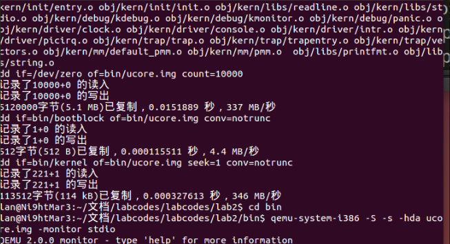

# __UCORE lab2 物理内存管理__

## __一、实验目的__

* 理解基于段页式内存地址的转换机制
* 理解页表的建立和使用方法
* 理解物理内存的管理方法

## __二、实验内容__

&emsp;&emsp;本次实验包含三个部分。首先了解如何发现系统中的物理内存；然后了解如何建立对物理内存的初步管理，即了解连续物理内存管理；最后了解页表相关的操作，即如何建立页表来实现虚拟内存到物理内存之间的映射，对段页式内存管理机制有一个比较全面的了解。本实验里面实现的内存管理还是非常基本的，并没有涉及到对实际机器的优化，比如针对 cache 的优化等。如果大家有余力，尝试完成扩展练习。

## __三、实验原理与实验步骤__

### __3.1 实验相关原理__
#### __3.1.1 探测系统物理内存布局__

&emsp;&emsp;当 ucore被启动之后，最重要的事情就是知道还有多少内存可用，一般来说，获取内存大小的方法由BIOS 中断调用和直接探测两种。但BIOS中断调用方法是一般只能在实模式下完成，而直接探测方法必须在保护模式下完成。通过BIOS 中断获取内存布局有三种方式，都是基于INT 15h中断，分别为88h e801he820h。但是并非在所有情况下这三种方式都能工作。在 Linux kernel里，采用的方法是依次尝试这三种方法。而在本实验中，我们通过e820h中断获取内存信息。因为e820h中断必须在实模式下使用，所以我们在
bootloader 进入保护模式之前调用这个 BIOS 中断，并且把 e820 映
射结构保存在物理地址0x8000处。这部分内容具体的代码在boot/bootasm.S中。

&emsp;&emsp;探测系统物理内存布局，其基本方法是通过BIOS中断调用来帮助完成的。其中BIOS中断调用必须在实模式下进行，所以在bootloader进入保护模式前完成这部分工作相对比较合适。这些部分由boot/bootasm.S中从probe\_memory处到finish\_probe处的代码部分完成。通过BIOS中断获取内存可调用参数为e820h的INT
15h BIOS中断。BIOS通过系统内存映射地址描述符（Address Range
Descriptor）格式来表示系统物理内存布局，其具体表示如下：
```asm
Offset  Size    Description
00h    8字节   base address               #系统内存块基地址
08h    8字节   length in bytes            #系统内存大小
10h    4字节   type of address range     #内存类型
```
看下面的(Values for System Memory Map address type)
```
Values for System Memory Map address type:
01h    memory, available to OS
02h    reserved, not available (e.g. system ROM, memory-mapped device)
03h    ACPI Reclaim Memory (usable by OS after reading ACPI tables)
04h    ACPI NVS Memory (OS is required to save this memory between NVS sessions)
other  not defined yet -- treat as Reserved
```
INT15h BIOS中断的详细调用参数如下:
```
eax：e820h：INT 15的中断调用参数；
edx：534D4150h (即4个ASCII字符“SMAP”) ，这只是一个签名而已；
ebx：如果是第一次调用或内存区域扫描完毕，则为0。 如果不是，则存放上次调用之后的计数值；
ecx：保存地址范围描述符的内存大小,应该大于等于20字节；
es:di：指向保存地址范围描述符结构的缓冲区，BIOS把信息写入这个结构的起始地址。
```
中断的返回值为:
```
eflags的CF位：若INT 15中断执行成功，则不置位，否则置位；

eax：534D4150h ('SMAP') ；

es:di：指向保存地址范围描述符的缓冲区,此时缓冲区内的数据已由BIOS填写完毕

ebx：下一个地址范围描述符的计数地址

ecx    ：返回BIOS往ES:DI处写的地址范围描述符的字节大小

ah：失败时保存出错代码
```
&emsp;&emsp;这样可以通过调用INT 15h
BIOS中断，递增di的值（20的倍数），让BIOS帮我们查找出一个一个的内存布局entry，并放入到一个保存地址范围描述符结构的缓冲区中，供后续的ucore进一步进行物理内存管理。这个缓冲区结构定义在memlayout.h中：
```c
struct e820map {
                  int nr_map;
                  struct {
                                    long long addr;
                                    long long size;
                                    long type;
                  } map[E820MAX];
};
```


物理内存探测是在bootasm.S中实现的，相关代码很短，如下所示：
```x86asm
probe_memory:
//对0x8000处的32位单元清零,即给位于0x8000处的
//struct e820map的成员变量nr_map清零
                  movl $0, 0x8000
                  xorl %ebx, %ebx
//表示设置调用INT 15h BIOS中断后，BIOS返回的映射地址描述符的起始地址
                  movw $0x8004, %di
start_probe:
                  movl $0xE820, %eax // INT 15的中断调用参数
//设置地址范围描述符的大小为20字节，其大小等于struct e820map的成员变量map的大小
                  movl $20, %ecx
//设置edx为534D4150h (即4个ASCII字符“SMAP”)，这是一个约定
                  movl $SMAP, %edx
//调用int 0x15中断，要求BIOS返回一个用地址范围描述符表示的内存段信息
                  int $0x15
//如果eflags的CF位为0，则表示还有内存段需要探测
                  jnc cont
//探测有问题，结束探测
                  movw $12345, 0x8000
                  jmp finish_probe
cont:
//设置下一个BIOS返回的映射地址描述符的起始地址
                  addw $20, %di
//递增struct e820map的成员变量nr_map
                  incl 0x8000
//如果INT0x15返回的ebx为零，表示探测结束，否则继续探测
                  cmpl $0, %ebx
                  jnz start_probe
finish_probe:
```
&emsp;&emsp;上述代码正常执行完毕后，在0x8000地址处保存了从BIOS中获得的内存分布信息，此信息按照struct
e820map的设置来进行填充。这部分信息将在bootloader启动ucore后，由ucore的page\_init函数来根据struct
e820map的memmap（定义了起始地址为0x8000）来完成对整个机器中的物理内存的总体管理。

#### __3.1.2 以页为单位管理物理内存__

&emsp;&emsp;在获得可用物理内存范围后，系统需要建立相应的数据结构来管理以物理页（按4KB对齐，且大小为4KB的物理内存单元）为最小单位的整个物理内存，以配合后续涉及的分页管理机制。每个物理页可以用一个
Page数据结构来表示。由于一个物理页需要占用一个Page结构的空间，Page结构在设计时须尽可能小，以减少对内存的占用。Page的定义在kern/mm/memlayout.h中。以页为单位的物理内存分配管理的实现在kern/default\_pmm.[ch]。

&emsp;为了与以后的分页机制配合，UCORE首先建立对整个计算机的每一个物理页的属性用结构Page来表示，它包含了映射此物理页的虚拟页个数，描述物理页属性的flags和双向链接各个Page结构的page\_link双向链表。
```c
struct Page {
    int ref;        // page frame's reference counter
    uint32_t flags; // array of flags that describe the status of the page frame
    unsigned int property;// the num of free block, used in first fit pm manager
    list_entry_t page_link;// free list link
};
```
&emsp;&emsp;这里看看Page数据结构的各个成员变量有何具体含义。ref表示这页被页表的引用记数（在“实现分页机制”一节会讲到）。如果这个页被页表引用了，即在某页表中有一个页表项设置了一个虚拟页到这个Page管理的物理页的映射关系，就会把Page的ref加一；反之，若页表项取消，即映射关系解除，就会把Page的ref减一。flags表示此物理页的状态标记，进一步查看kern/mm/memlayout.h中的定义，可以看到：
```c
/* Flags describing the status of a page frame */
#define PG_reserved                 0       // the page descriptor is reserved for kernel or unusable
#define PG_property                 1       // the member 'property' is valid
```
&emsp;&emsp;这表示flags目前用到了两个bit表示页目前具有的两种属性，bit
0表示此页是否被保留（reserved），如果是被保留的页，则bit
0会设置为1，且不能放到空闲页链表中，即这样的页不是空闲页，不能动态分配与释放。比如目前内核代码占用的空间就属于这样“被保留”的页。在本实验中，bit
1表示此页是否是free的，如果设置为1，表示这页是free的，可以被分配；如果设置为0，表示这页已经被分配出去了，不能被再二次分配。另外，本实验这里取的名字PG\_property比较不直观
，主要是我们可以设计不同的页分配算法（best fit, buddy
system等），那么这个PG\_property就有不同的含义了。

关于Page结构体在UCORE中实现的更多的说明，请参考：[Page在UCORE中具体实现](./picturefig/Page.md)

#### __3.1.3 物理内存分配算法__
&emsp;&emsp;物理内存分配是大家在理论课中学习的比较扎实的部分，内容也不止firstfit一种算法，在UCORE中，主要是使用了first算法来实现。这部分内容将在练习中结合具体的代码进行说明，关于更多的物理内存分配算法[内存管理算法介绍](https://blog.csdn.net/topasstem8/article/details/42558233)

#### __3.1.4 分页机制__

&emsp;&emsp;x86体系结构将内存地址分成三种：逻辑地址（也称虚地址）、线性地址和物理地址。逻辑地址即是程序指令中使用的地址，物理地址是实际访问内存的地址。逻
辑地址通过段式管理的地址映射可以得到线性地址，线性地址通过页式管理的地址映射得到物理地址, 这部分内容在实验1已经有接触。

 


&emsp;&emsp;段式管理在实验1中已经讨论过。在 ucore
中段式管理只起到了一个过渡作用，它将逻辑地址不加转换直接映射成线性地址。


&emsp;&emsp;页式管理将线性地址分成三部分（图中的
Linear Address 的 Directory 部分、 Table 部分和 Offset 部分）。ucore
的页式管理通过一个二级的页表实现。一级页表的起始物理地址存放在 cr3
寄存器中，这个地址必须是一个页对齐的地址，也就是低 12 位必须为
0。目前，ucore 用boot\_cr3（mm/pmm.c）记录这个值。

###  __3.2 实验步骤__
#### __3.2.1 练习０__
>_填写已有实验_   
_实验依赖于实验０，需要将实验１中已经填写的内容在本实验中进行填写。_  

&emsp;&emsp;经过使用meld进行前后文件的对比，发现仅有kedebug.c和trap.c两个文件中缺失了部分代码，在进行补全之后，进行相关的实验。　　

#### __3.2.1 练习１__
>_在实现first fit 内存分配算法的回收函数时，要考虑地址连续的空闲块之间的合并操作。提示:在建立空闲页块链表时，需要按照空闲页块起始地址来排序，形成一个有序的链表。可能会修改default_pmm.c中的default_init，default_init_memmap，default_alloc_pages， default_free_pages等相关函数。请仔细查看和理解default_pmm.c中的注释。_
_请在实验报告中简要说明你的设计实现过程。_

&emsp;&emsp;first的原理是要求空闲分区链地址递增的次序链接。在分配内存时，从链首开始顺序查找，直至找到一个大小能满足要求的分区为止；然后再按照作业的大小，从该分区中划出一块内存空间分配给请求者，余下的空闲分区任留在空闲链中。若从链首直到链尾都不能找到一个能满足要求的分区，则此次内存分配失败，返回。该算法倾向于优先利用内存中低地址部分的空闲分区，从而保留了高址部分的大空闲区。这给为以后到达的大作业分配大的内存空间创造了条件，其缺点是低址部分不断被划分，会留下许多难以利用的、很小的空闲分区，而每次查找又都是从低址部分开始，这无疑会增加查找可用空闲分区时的开销。　　

&emsp;&emsp;first\_fit分配算法需要维护一个查找有序（地址按从小到大排列）空闲块（以页为最小单位的连续地址空间）的数据结构，而双向链表是一个很好的选择。

&emsp;&emsp;libs/list.h定义了可挂接任意元素的通用双向链表结构和对应的操作，所以需要了解如何使用这个文件提供的各种函数，从而可以完成对双向链表的初始化/插入/删除等。

&emsp;&emsp;kern/mm/memlayout.h中定义了一个 free\_area\_t 数据结构
```c
typedef struct {
    list_entry_t free_list;         // the list header
    unsigned int nr_free;           // number of free pages in this free list
} free_area_t;
```
- free_list是一个list_entry结构的双向链表指针
- nr_free则记录当前空闲页的个数  

&emsp;&emsp;有了这两个数据结构，就可以管理起来整个以页尾单位的物理内存空间,可以通过free_area_t来完成对空闲块的管理。而default\_pmm.c中定义的free\_area变量就是干这个事情的。

&emsp;&emsp;kern/mm/pmm.h中定义了一个通用的分配算法的函数列表，用pmm\_manager表示。其中init函数就是用来初始化free\_area变量的,
first\_fit分配算法可直接重用default\_init函数的实现。init\_memmap函数需要根据现有的内存情况构建空闲块列表的初始状态。

通过分析代码，可以知道执行时间：
```
kern_init --> pmm_init-->page_init-->init_memmap--> pmm_manager->init_memmap
```
&emsp;&emsp;所以，default\_init\_memmap需要根据page\_init函数中传递过来的参数（某个连续地址的空闲块的起始页，页个数）来建立一个连续内存空闲块的双向链表。这里有一个假定page\_init函数是按地址从小到大的顺序传来的连续内存空闲块的。链表头是free\_area.free\_list，链表项是Page数据结构的base-\>page\_link。这样我们就依靠Page数据结构中的成员变量page\_link形成了连续内存空闲块列表。

下面是具体的修改代码的步骤：  
- __default_init__ 

可以查看给出的注释：

```c
default_init: you can reuse the demo default_init fun to init the free_list and set nr_free to 0. 
free_list is used to record the free mem blocks. nr_free is the total number for free mem blocks.
```

注释里标的很清楚，不需要修改。
- __default_init_memmap__  
 
&emsp;&emsp;default\_init\_memmap函数将根据每个物理页帧的情况来建立空闲页链表，且空闲页块应该是根据地址高低形成一个有序链表。

&emsp;&emsp;首先查看[注释](./picturefig/lab2_default_init_memmap.md),
根据注释查看变相关[定义](./picturefig/lab2_default_init_memmap相关定义.md)，并根据定义来修改代码：  
 
```c
static void
default_init_memmap(struct Page *base, size_t n) {
    assert(n > 0);
    struct Page *p = base;
    for (; p != base + n; p ++) {
        assert(PageReserved(p));//判断是否是保留页，断言手法
        p->flags = p->property = 0;//设置标志位
        SetPageProperty(p);//设置bit
        set_page_ref(p, 0);//清空被引用的次数
        list_add(&free_list, &(p->page_link));//将此页插入到空闲页的链表里面
    }
    base->property = n;//连续内存空闲块的大小为n
    //SetPageProperty(base);
    nr_free += n;//说明有n个连续空闲块
    //list_add(&free_list, &(base->page_link));
}
```
- __default_alloc_pages__  

&emsp;&emsp;firstfit需要从空闲链表头开始查找最小的地址，通过list_next找到下一个空闲块元素，通过le2page宏可以由链表元素获得对应的Page指针p。通过p->property可以了解此空闲块的大小。如果>=n，这就找到了！如果<n，则list_next，继续查找。直到list_next== &free_list，这表示找完了一遍了。找到后，就要从新组织空闲块，然后把找到的page返回。  
&emsp;&emsp;default_alloc_pages函数用于为进程分配空闲页。其分配的步骤如下： 

-  寻找足够大的空闲块，如果找到了，重新设置标志位 
-  从空闲链表中删除此页 
-  判断空闲块大小是否合适 ，如果不合适，分割页块 ，如果合适则不进行操作 
-  计算剩余空闲页个数 
-  返回分配的页块地址  

需要修改的代码如下：


此时查看[注释](./picturefig/lab2_default_alloc_pages.md) ,并且根据注释查看相关的[定义](./picturefig/lab2_default_alloc_pages相关定义.md)

根据注释修改代码如下  
```c
static struct Page *
default_alloc_pages(size_t n) {
    assert(n > 0);
    if (n > nr_free) {//当空闲页不够时，返回NULL
        return NULL;
    }
    list_entry_t *le = &free_list;
    while ((le = list_next(le)) != &free_list) {//遍历所有指针
        struct Page *p = le2page(le, page_link);//转换为页结构
        if (p->property >= n) {//如果找到空闲页大小大于等于n时选中
            int i;
            list_entry_t *len;
            for(i = 0; i < n; i++)//初始化分配内存
            {
                len = list_next(le);
                struct Page *p2 = le2page(temp_le, page_link);    //转换页结构
                SetPageReserved(p2);  //初始化标志位
                ClearPageProperty(p2);   
                list_del(le);  //清除双向链表指针
                le = len;  
            }
            if(p->property > n)
            {  
                //若大小>n,只取大小为n的块
                (le2page(le,page_link))->property = p->property - n;  
            }  
            ClearPageProperty(p);  //初始化标志位
            SetPageReserved(p);  
            nr_free -= n;  //空闲页大小-n
            return p;  
        }
    }
    return NULL;//分配失败
}
```
- __default_free_pages__  

&emsp;&emsp;default\_free\_pages函数的实现其实是default\_alloc\_pages的逆过程，不过需要考虑空闲块的合并问题。
default_free_pages
这个函数的作用是释放已经使用完的页，把他们合并到free_list中。具体的步骤如下：  
- 在free_list 中查找合适的位置以供插入  
- 改变被释放页的标志位，以及头部的计数器  
- 尝试在free_list 中向高地址后者低地址合并 

首先查看[注释](./picturefig/lab2_default_free_pages.md),并且根据注释，来查看相关[定义](./picturefig/lab2_default_free_pages相关定义.md)。  
修改代码如下：
```C
static void
default_free_pages(struct Page *base, size_t n) {
    assert(n > 0);
    assert(PageReserved(base));

    list_entry_t *le = &free_list;//找合适的位置
    struct Page *p = base;
    while((le=list_next(le)) != &free_list) 
    {
        p = le2page(le, page_link);
        if(p > base)
        {
            break;
        }
    }
    for(p = base; p < base + n; p++)//在之前插入n个空闲页
    {
        list_add_before(le, &(p->page_link));
        p->flags = 0;//设置标志
        set_page_ref(p, 0);
        ClearPageProperty(p);
        SetPageProperty(p);
    }

    base->property = n;//设置连续大小为n
    //如果是高位，则向高地址合并
    p = le2page(le,page_link);
    if(base + base->property == p )
    {
        base->property += p->property;
        p->property = 0;
    }
    //如果是低位且在范围内，则向低地址合并
    le = list_prev(&(base->page_link));
    p = le2page(le, page_link);
    if(le != &free_list && p == base-1)//满足条件，未分配则合并
    {
        while(le != &free_list)
        {
            if(p->property)//当连续时
            {
                p->property += base->property;
                base->property = 0;
                break;
            }
            le = list_prev(le);
            p = le2page(le,page_link);
        }
    }

    nr_free += n;
}
```

#### __3.2.3 练习2__
>实现寻找虚拟地址对应的页表项(需要编程)  
  通过设置页表和对应的页表项，可建立虚拟内存地址和物理内存地址的对应关系。其中的get_pte函数是设置页表项缓解中的一个重要步骤。此函数找到一个虚地址对应的二级页表项的内核虚地址，如果此二级页表项不存在，则分配一个包含此项的二级页表。

首先，查看相关的定义
```C
#define PGSIZE 4096 // bytes mapped by a page
```
- PDX(la)： 返回虚拟地址la的页目录索引
- KADDR(pa): 返回物理地址pa相关的内核虚拟地址
- set_page_ref(page,1): 设置此页被引用一次
- page2pa(page): 得到page管理的那一页的物理地址
- struct Page * alloc_page() : 分配一页出来
- memset(void * s, char c, size_t n) : 设置s指向地址的前面n个字节为字节‘c’
- PTE_P 0x001 表示物理内存页存在
- PTE_W 0x002 表示物理内存页内容可写
- PTE_U 0x004 表示可以读取对应地址的物理内存页内容
根据注释修改代码  
```C
//get_pte - get pte and return the kernel virtual address of this pte for la
//        - if the PT contians this pte didn't exist, alloc a page for PT
// parameter:
//  pgdir:  the kernel virtual base address of PDT
//  la:     the linear address need to map
//  create: a logical value to decide if alloc a page for PT
// return vaule: the kernel virtual address of this pte
pte_t *
get_pte(pde_t *pgdir, uintptr_t la, bool create) {
    /* LAB2 EXERCISE 2: YOUR CODE
     *
     * If you need to visit a physical address, please use KADDR()
     * please read pmm.h for useful macros
     *
     * Maybe you want help comment, BELOW comments can help you finish the code
     *
     * Some Useful MACROs and DEFINEs, you can use them in below implementation.
     * MACROs or Functions:
     *   PDX(la) = the index of page directory entry of VIRTUAL ADDRESS la.
     *   KADDR(pa) : takes a physical address and returns the corresponding kernel virtual address.
     *   set_page_ref(page,1) : means the page be referenced by one time
     *   page2pa(page): get the physical address of memory which this (struct Page *) page  manages
     *   struct Page * alloc_page() : allocation a page
     *   memset(void *s, char c, size_t n) : sets the first n bytes of the memory area pointed by s
     *                                       to the specified value c.
     * DEFINEs:
     *   PTE_P           0x001                   // page table/directory entry flags bit : Present
     *   PTE_W           0x002                   // page table/directory entry flags bit : Writeable
     *   PTE_U           0x004                   // page table/directory entry flags bit : User can access
     */
    //typedef uintptr_t pde_t;
    pde_t *pdep = &pgdir[PDX(la)];  // (1)获取页表
    if (!(*pdep & PTE_P))             // (2)假设页目录项不存在
    {      
        struct Page *page;
        if (!create || (page = alloc_page()) == NULL) // (3) check if creating is needed, then alloc page for page table
        {    //假如不需要分配或是分配失败
            return NULL;
        }
        set_page_ref(page, 1);                      // (4)设置被引用1次
        uintptr_t pa = page2pa(page);                  // (5)得到该页物理地址
        memset(KADDR(pa), 0, PGSIZE);                  // (6)物理地址转虚拟地址，并初始化
        *pdep = pa | PTE_U | PTE_W | PTE_P;            // (7)设置可读，可写，存在位
    }
    return &((pte_t *)KADDR(PDE_ADDR(*pdep)))[PTX(la)];     // (8) return page table entry
    //KADDR(PDE_ADDR(*pdep)):这部分是由页目录项地址得到关联的页表物理地址，再转成虚拟地址
    //PTX(la)：返回虚拟地址la的页表项索引
    //最后返回的是虚拟地址la对应的页表项入口地址
}
```

## __练习3__
>释放某虚拟地址所在的页并取消对应的二级页表项的映射（需要编程） 
  当释放一个包含某虚地址的物理内存页时，需要让对应此物理内存页的管理数据结构Page做相关的清除处理，使得次物理内存页成为空闲；另外还需把表示虚地址与物理地址对应关系的二级页表项清除

查看代码中的相关定义  
```C
struct Page *alloc_pages(size_n){
    void free_pages(struct Page *base, size_t n);
    size_t nr_free_pages(void);
}

#define alloc_page() alloc_pages(1)
#define free_page(page) free_pages(page, 10)
 // invalidate a TLB entry, but only if the the page tables being
 //edited are the ones currently in use by the processor.
 void tlb_invalidate(pde_t *pgdir, uintptr_t la){
     if(rcr3() == PADDR(pgdir)){
         invlpg((void *) la);
     }
 }

 static inline int page_ref_dec(struct Page *page){
     page->ref -= 1;
     return page->ref;
 }

 static inline struct Page* pte2page(pte_t pte){
     if (!(pte_t pte)){
         panic("pte2page called with invalid pte");
     }
     return pa2page(PTE_ADDR(pte));
 }
```
- struct Page *page pte2page(*ptep):得到页表项对应的那一页
- free_page : 释放一页
- page_ref_dec(page) : 减少该页的引用次数，返回剩下引用次数
- tlb_invalidate(pde_t * pgdir, uintptr_t la) : 当修改的页表-是进程正在使用的那些页表，使之无效 

```C
//page_remove_pte - free an Page sturct which is related linear address la
//                - and clean(invalidate) pte which is related linear address la
//note: PT is changed, so the TLB need to be invalidate 
static inline void
page_remove_pte(pde_t *pgdir, uintptr_t la, pte_t *ptep) {
    /* LAB2 EXERCISE 3: YOUR CODE
     *
     * Please check if ptep is valid, and tlb must be manually updated if mapping is updated
     *
     * Maybe you want help comment, BELOW comments can help you finish the code
     *
     * Some Useful MACROs and DEFINEs, you can use them in below implementation.
     * MACROs or Functions:
     *   struct Page *page pte2page(*ptep): get the according page from the value of a ptep
     *   free_page : free a page
     *   page_ref_dec(page) : decrease page->ref. NOTICE: ff page->ref == 0 , then this page should be free.
     *   tlb_invalidate(pde_t *pgdir, uintptr_t la) : Invalidate a TLB entry, but only if the page tables being
     *                        edited are the ones currently in use by the processor.
     * DEFINEs:
     *   PTE_P           0x001                   // page table/directory entry flags bit : Present
     */
    if (*ptep & PTE_P)                 //(1) check if this page table entry is present
    {      //假如页表项存在
        struct Page *page = pte2page(*ptep);//(2)找到页表项的那一页信息
        if (page_ref_dec(page) == 0)//(3)如果没有被引用
        { 
            free_page(page);//(4)释放该页
        }
        *ptep = 0;         //(5)该页目录项清零
        tlb_invalidate(pgdir, la); //(6) flush tlb当修改的页表是进程正在使用的那些页表，使之无效
    }

}
``` 

## __实验结果__



## 收获
  通过本次实验，我了解如何发现系统中的物理内存，了解如何建立对物理内存的初步管理，了解了页表的相关的操作，即如何建立页表来实现虚拟内存到物理内存之间的映射，对段页式内存管理机制有一个比较全面的了解。基本上在试验中学习，根据注释以及函数定义可以动手完成一个简单的物理内存管理系统。完成后发现运行错误，通过一遍一遍的核对代码，查阅资料，比对正确答案，终于得以修改，成功运行。

## __系统启动前做的工作__
1.在bootloader中，完成了对物理内存资源的探测工作（bootasm.S）

OS需要了解整个计算机系统中的物理内存如何分布的，哪些可用，哪些不可用。其基本方法是通过BIOS中断调用来帮助完成的。其中BIOS中断调用必须在实模式下进行，所以在bootloader进入保护模式前完成这部分工作。具体的流程是：通过BIOS中断获取内存可调用参数为e820h的INT 15H BIOS中断，之后通过系统内存映射地址描述符（Address Range Descriptor）格式来表示系统物理内存布局，并且该地址描述符保存在物理地址0x8000
保存地址范围描述符结构的缓冲区：
```c
struct e820map {
                  int nr_map;
                  struct {
                                    long long addr;
                                    long long size;
                                    long type;
                  } map[E820MAX];
};
```
下面是填充该结构体数据：
```s
probe_memory:
    movl $0, 0x8000      #对0x8000处的32位单元清零,即给位于0x8000处的struct e820map的成员变量nr_map清零
    xorl %ebx, %ebx      #ebx如果是第一次调用或内存区域扫描完毕，则为0
    movw $0x8004, %di 　　#表示设置调用INT 15h BIOS中断后，BIOS返回的映射地址map描述符的起始地址
start_probe:
    movl $0xE820, %eax  　　#INT 15的中断调用参数；
    movl $20, %ecx         #设置地址范围描述符的大小为20字节，其大小等于struct e820map的成员变量map的大小
    movl $SMAP, %edx    　　#设置edx为534D4150h (即4个ASCII字符“SMAP”)
    int $0x15              #调用int 0x15中断，要求BIOS返回一个用地址范围描述符表示的内存段信息，递增di的值（20的倍数），让BIOS帮我们查找出一个个的内存布局entry，并放入到一个保存地址范围描述符结构的缓冲区的map中
    jnc cont               #如果eflags的CF位为0，则表示还有内存段需要探测
    movw $12345, 0x8000 　　#探测有问题，结束探测
    jmp finish_probe
cont:
    addw $20, %di            #eflags的CF位为0，还有内存段需要检测，设置下一个BIOS返回的映射地址描述符的起始地址
    incl 0x8000              #递增struct e820map的成员变量nr_map
    cmpl $0, %ebx            #如果INT0x15返回的ebx为零，表示探测结束，否则继续探测
    jnz start_probe
finish_probe:
```
## __以页为单位管理物理内存：__
每个物理页可以用一个 Page数据结构来表示。Page结构也占空间，Page结构在设计时须尽可能小，以减少对内存的占用。具体结构的定义在kern/mm/memlayout.h中。
```c
struct Page {
    int ref;        // page frame's reference counter
    uint32_t flags; // array of flags that describe the status of the page frame
    unsigned int property;// the num of free block, used in first fit pm manager
    list_entry_t page_link;// free list link
};
```
ref：表示这页被页表引用次数，在某页表中有个页表项设置了该页到Page管理的页框的映射，则ref加1，若也表想取消映射，ref减1

flags：表示页框状态（有两bit来表示这状态，PG_reserved：0表示该页框被内核占用或不能使用，PG_property:1表示可用空闲页框，该名字可以根据不同的分配算法而不同）

设置的方法有set_bit（int nr，long*addr）将addr第nr置1，test_bit被测试位为0，返回0，为1，返回1。

property：记录某连续空间空闲页的个数，该变量只有在连续内存空间地址的最小页（头一页）才会被使用，连续内存其余空闲页利用这个页的该变量也可知自己所处空闲块中空闲页个数。

page_link：是便于把多个连续内存空闲块链接在一起的双向链接指针。连续内存空闲块利用该也的page_link来链接比他地址大和小的其他连续空
